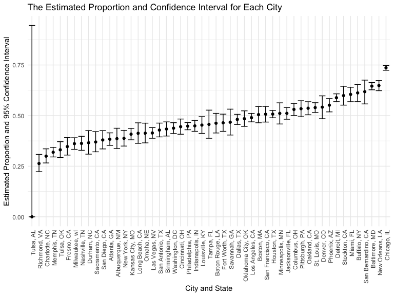
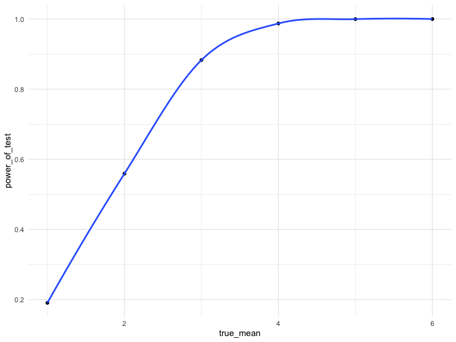
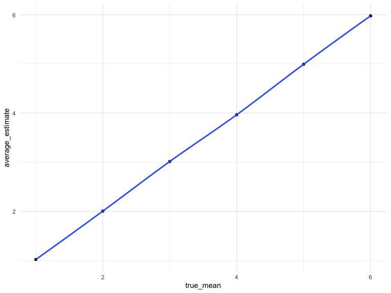

    library(tidyverse)

    ## ── Attaching packages ─────────────────────────────────────── tidyverse 1.3.2 ──
    ## ✔ ggplot2 3.3.6      ✔ purrr   0.3.4 
    ## ✔ tibble  3.1.8      ✔ dplyr   1.0.10
    ## ✔ tidyr   1.2.1      ✔ stringr 1.4.1 
    ## ✔ readr   2.1.2      ✔ forcats 0.5.2 
    ## ── Conflicts ────────────────────────────────────────── tidyverse_conflicts() ──
    ## ✖ dplyr::filter() masks stats::filter()
    ## ✖ dplyr::lag()    masks stats::lag()

    library(p8105.datasets)
    library(viridis)

    ## Loading required package: viridisLite

    library(purrr)
    knitr::opts_chunk$set(
        echo = TRUE,
        warning = FALSE,
        fig.width = 8, 
      fig.height = 6,
      out.width = "90%"
    )

    options(
      ggplot2.continuous.colour = "viridis",
      ggplot2.continuous.fill = "viridis"
    )

    scale_colour_discrete = scale_colour_viridis_d
    scale_fill_discrete = scale_fill_viridis_d

    theme_set(theme_minimal() + theme(legend.position = "bottom"))

# Problem 2

# Describe the raw data

The raw data contain ‘r nrow(raw\_data)’ rows and ‘r ncol(raw\_data)’ of
variables, which are ‘r colnames(raw\_data)’. The variables provide
information about the date of the report of the homicide, their names,
race, age, sex, which city and state they are from with both names and
latitudes and longitudes provided, and their disposition.

    raw_data = read_csv("./data/homicide-data.csv")

    ## Rows: 52179 Columns: 12
    ## ── Column specification ────────────────────────────────────────────────────────
    ## Delimiter: ","
    ## chr (9): uid, victim_last, victim_first, victim_race, victim_age, victim_sex...
    ## dbl (3): reported_date, lat, lon
    ## 
    ## ℹ Use `spec()` to retrieve the full column specification for this data.
    ## ℹ Specify the column types or set `show_col_types = FALSE` to quiet this message.

    # Create a city_state variable
    homicides_data = 
      raw_data %>% 
      janitor::clean_names() %>% 
      mutate(city_state = str_c(city, ", ", state)) %>% 
      relocate(city_state, .after = reported_date)

    homicides_data

    ## # A tibble: 52,179 × 13
    ##    uid       repor…¹ city_…² victi…³ victi…⁴ victi…⁵ victi…⁶ victi…⁷ city  state
    ##    <chr>       <dbl> <chr>   <chr>   <chr>   <chr>   <chr>   <chr>   <chr> <chr>
    ##  1 Alb-0000…  2.01e7 Albuqu… GARCIA  JUAN    Hispan… 78      Male    Albu… NM   
    ##  2 Alb-0000…  2.01e7 Albuqu… MONTOYA CAMERON Hispan… 17      Male    Albu… NM   
    ##  3 Alb-0000…  2.01e7 Albuqu… SATTER… VIVIANA White   15      Female  Albu… NM   
    ##  4 Alb-0000…  2.01e7 Albuqu… MENDIO… CARLOS  Hispan… 32      Male    Albu… NM   
    ##  5 Alb-0000…  2.01e7 Albuqu… MULA    VIVIAN  White   72      Female  Albu… NM   
    ##  6 Alb-0000…  2.01e7 Albuqu… BOOK    GERALD… White   91      Female  Albu… NM   
    ##  7 Alb-0000…  2.01e7 Albuqu… MALDON… DAVID   Hispan… 52      Male    Albu… NM   
    ##  8 Alb-0000…  2.01e7 Albuqu… MALDON… CONNIE  Hispan… 52      Female  Albu… NM   
    ##  9 Alb-0000…  2.01e7 Albuqu… MARTIN… GUSTAVO White   56      Male    Albu… NM   
    ## 10 Alb-0000…  2.01e7 Albuqu… HERRERA ISRAEL  Hispan… 43      Male    Albu… NM   
    ## # … with 52,169 more rows, 3 more variables: lat <dbl>, lon <dbl>,
    ## #   disposition <chr>, and abbreviated variable names ¹​reported_date,
    ## #   ²​city_state, ³​victim_last, ⁴​victim_first, ⁵​victim_race, ⁶​victim_age,
    ## #   ⁷​victim_sex

    # Summarize within cities to obtain the total number of homicides and the number of unsolved homicides (those for which the disposition is “Closed without arrest” or “Open/No arrest”).
    unique(homicides_data$disposition)

    ## [1] "Closed without arrest" "Closed by arrest"      "Open/No arrest"

    homicides_data %>% 
      group_by(city_state) %>% 
      summarize(
        total_homicides = n(),
        unsolved_homicides = sum(disposition == "Closed without arrest") + sum(disposition == "Open/No arrest")
      ) 

    ## # A tibble: 51 × 3
    ##    city_state      total_homicides unsolved_homicides
    ##    <chr>                     <int>              <int>
    ##  1 Albuquerque, NM             378                146
    ##  2 Atlanta, GA                 973                373
    ##  3 Baltimore, MD              2827               1825
    ##  4 Baton Rouge, LA             424                196
    ##  5 Birmingham, AL              800                347
    ##  6 Boston, MA                  614                310
    ##  7 Buffalo, NY                 521                319
    ##  8 Charlotte, NC               687                206
    ##  9 Chicago, IL                5535               4073
    ## 10 Cincinnati, OH              694                309
    ## # … with 41 more rows

    # For the city of Baltimore, MD, use the prop.test function to estimate the proportion of homicides that are unsolved, save the output of prop.test as an R object, apply the broom::tidy to this object and pull the estimated proportion and confidence intervals from the resulting tidy dataframe.

    baltimore_homicide = 
      homicides_data %>% 
      filter(city_state == "Baltimore, MD") %>% 
      group_by(city_state) %>% 
      summarize(
        bal_total_homicides = n(),
        bal_unsolved_homicides = sum(disposition == "Closed without arrest") + sum(disposition == "Open/No arrest")
      )

    baltimore_homicide_test = 
      prop.test(
        x = baltimore_homicide %>% pull(bal_unsolved_homicides),
        n = baltimore_homicide %>% pull(bal_total_homicides)
      )

    baltimore_homicide_test

    ## 
    ##  1-sample proportions test with continuity correction
    ## 
    ## data:  baltimore_homicide %>% pull(bal_unsolved_homicides) out of baltimore_homicide %>% pull(bal_total_homicides), null probability 0.5
    ## X-squared = 239.01, df = 1, p-value < 2.2e-16
    ## alternative hypothesis: true p is not equal to 0.5
    ## 95 percent confidence interval:
    ##  0.6275625 0.6631599
    ## sample estimates:
    ##         p 
    ## 0.6455607

    tidied_test = 
      baltimore_homicide_test %>% 
      broom::tidy()
    tidied_test

    ## # A tibble: 1 × 8
    ##   estimate statistic  p.value parameter conf.low conf.high method        alter…¹
    ##      <dbl>     <dbl>    <dbl>     <int>    <dbl>     <dbl> <chr>         <chr>  
    ## 1    0.646      239. 6.46e-54         1    0.628     0.663 1-sample pro… two.si…
    ## # … with abbreviated variable name ¹​alternative

    bal_estimate = tidied_test %>% pull(estimate)
    bal_lower_CI = tidied_test %>% pull(conf.low)
    bal_upper_CI = tidied_test %>% pull(conf.high)

    bal_estimates_data = list(
                              "Estimated_Proportion" = bal_estimate,
                              "Lower_CI_Bound" = bal_lower_CI,
                              "Upper_CI_Bound" = bal_upper_CI
    )

    bal_estimates_data

    ## $Estimated_Proportion
    ##         p 
    ## 0.6455607 
    ## 
    ## $Lower_CI_Bound
    ## [1] 0.6275625
    ## 
    ## $Upper_CI_Bound
    ## [1] 0.6631599

    # Run prop.test for each of the cities in your dataset, and extract both the proportion of unsolved homicides and the confidence interval for each

    # Create the function for getting the proportion of unsolved homicides and the confidence interval for each city from prop.test
    proptest = function(citystate_name) {
      city_data = 
        homicides_data %>% 
        filter(city_state == citystate_name) %>% 
        group_by(city_state) %>% 
        summarize(
        city_total_homicides = n(),
        city_unsolved_homicides = sum(disposition == "Closed without arrest") + sum(disposition == "Open/No arrest")
        )
      
      city_prop_test = 
        prop.test(
        x = city_data %>% pull(city_unsolved_homicides),
        n = city_data %>% pull(city_total_homicides)
      ) %>% 
        broom::tidy() %>% 
        select(estimate, conf.low, conf.high)
      
      city_prop_test
    }

    city_state_name = unique(homicides_data$city_state)

    city_prop_test = 
      expand_grid(city_state = city_state_name) %>% 
      mutate(test_results = map(city_state, proptest)) %>% 
      unnest(test_results)

    city_prop_test

    ## # A tibble: 51 × 4
    ##    city_state      estimate conf.low conf.high
    ##    <chr>              <dbl>    <dbl>     <dbl>
    ##  1 Albuquerque, NM    0.386    0.337     0.438
    ##  2 Atlanta, GA        0.383    0.353     0.415
    ##  3 Baltimore, MD      0.646    0.628     0.663
    ##  4 Baton Rouge, LA    0.462    0.414     0.511
    ##  5 Birmingham, AL     0.434    0.399     0.469
    ##  6 Boston, MA         0.505    0.465     0.545
    ##  7 Buffalo, NY        0.612    0.569     0.654
    ##  8 Charlotte, NC      0.300    0.266     0.336
    ##  9 Chicago, IL        0.736    0.724     0.747
    ## 10 Cincinnati, OH     0.445    0.408     0.483
    ## # … with 41 more rows

    n = unique(city_prop_test$city_state)
    n

    ##  [1] "Albuquerque, NM"    "Atlanta, GA"        "Baltimore, MD"     
    ##  [4] "Baton Rouge, LA"    "Birmingham, AL"     "Boston, MA"        
    ##  [7] "Buffalo, NY"        "Charlotte, NC"      "Chicago, IL"       
    ## [10] "Cincinnati, OH"     "Columbus, OH"       "Dallas, TX"        
    ## [13] "Denver, CO"         "Detroit, MI"        "Durham, NC"        
    ## [16] "Fort Worth, TX"     "Fresno, CA"         "Houston, TX"       
    ## [19] "Indianapolis, IN"   "Jacksonville, FL"   "Kansas City, MO"   
    ## [22] "Las Vegas, NV"      "Long Beach, CA"     "Los Angeles, CA"   
    ## [25] "Louisville, KY"     "Memphis, TN"        "Miami, FL"         
    ## [28] "Milwaukee, wI"      "Minneapolis, MN"    "Nashville, TN"     
    ## [31] "New Orleans, LA"    "New York, NY"       "Oakland, CA"       
    ## [34] "Oklahoma City, OK"  "Omaha, NE"          "Philadelphia, PA"  
    ## [37] "Phoenix, AZ"        "Pittsburgh, PA"     "Richmond, VA"      
    ## [40] "San Antonio, TX"    "Sacramento, CA"     "Savannah, GA"      
    ## [43] "San Bernardino, CA" "San Diego, CA"      "San Francisco, CA" 
    ## [46] "St. Louis, MO"      "Stockton, CA"       "Tampa, FL"         
    ## [49] "Tulsa, OK"          "Tulsa, AL"          "Washington, DC"

    # Create a plot that shows the estimates and CIs for each city – check out geom_errorbar for a way to add error bars based on the upper and lower limits. Organize cities according to the proportion of unsolved homicides.
    city_prop_test %>% 
      mutate(city_state = reorder(city_state, estimate)) %>% 
      ggplot(aes(x = city_state, y = estimate)) +
      geom_point() +
      labs(
            title = "The Estimated Proportion and Confidence Interval for Each City",
            x = "City and State",
            y = "Estimated Proportion and 95% Confidence Interval"
                ) +
      geom_errorbar(aes(ymin = conf.low, ymax = conf.high)) +  
      theme(axis.text.x = element_text(angle = 90, vjust = 0.8, hjust=1))

      theme(legend.position = "bottom") 

    ## List of 1
    ##  $ legend.position: chr "bottom"
    ##  - attr(*, "class")= chr [1:2] "theme" "gg"
    ##  - attr(*, "complete")= logi FALSE
    ##  - attr(*, "validate")= logi TRUE

# Problem 3

    # Set μ=0. Generate 5000 datasets from the model
    new_data = rerun(5000, rnorm(n = 30, mean = 0, sd = 5))

    # For each dataset, save μ̂  and the p-value arising from a test of H:μ=0 using α=0.05. Hint: to obtain the estimate and p-value, use broom::tidy to clean the output of t.test
    t_test = function(mu = 0){
      data_t_test = tibble(rnorm(n = 30, mean = mu, sd = 5))
      
      results = 
        t.test(data_t_test) %>% 
        broom::tidy() %>% 
        select(estimate, p.value)
      results
    }

    t_test()

    ## # A tibble: 1 × 2
    ##   estimate p.value
    ##      <dbl>   <dbl>
    ## 1    0.161   0.860

    mu_is_0 = 
      expand.grid(true_mean = 0, iter = 1:5000) %>% 
      mutate(test_results = map(true_mean, t_test)) %>% 
      unnest(test_results)

    head(mu_is_0)

    ## # A tibble: 6 × 4
    ##   true_mean  iter estimate p.value
    ##       <dbl> <int>    <dbl>   <dbl>
    ## 1         0     1    0.940  0.325 
    ## 2         0     2    1.85   0.0519
    ## 3         0     3   -0.312  0.668 
    ## 4         0     4   -0.624  0.578 
    ## 5         0     5    0.264  0.788 
    ## 6         0     6    1.04   0.337

    # Repeat the above for  μ={1,2,3,4,5,6}
    mu_not_0 = 
      expand.grid(true_mean = 1:6, iter = 1:5000) %>% 
      mutate(test_results = map(true_mean, t_test)) %>% 
      unnest(test_results)

    head(mu_not_0)

    ## # A tibble: 6 × 4
    ##   true_mean  iter estimate      p.value
    ##       <int> <int>    <dbl>        <dbl>
    ## 1         1     1     3.46 0.000382    
    ## 2         2     1     1.81 0.0515      
    ## 3         3     1     4.13 0.00000133  
    ## 4         4     1     2.44 0.00937     
    ## 5         5     1     3.71 0.000143    
    ## 6         6     1     5.21 0.0000000523

    # Make a plot showing the proportion of times the null was rejected (the power of the test) on the y axis and the true value of μ on the x axis. Describe the association between effect size and power.
    mu_not_0 %>% 
      filter(p.value < 0.05) %>% 
      group_by(true_mean) %>% 
      summarize(
        power_of_test = n() / 5000
      ) %>% 
      ggplot(aes(x = true_mean, y = power_of_test)) +
      geom_point() +
      geom_smooth()

    ## `geom_smooth()` using method = 'loess' and formula 'y ~ x'

      labs(
            title = "The association between effect size and power",
            x = "True Value of mu",
            y = "The Power of the Test"
                )

    ## $x
    ## [1] "True Value of mu"
    ## 
    ## $y
    ## [1] "The Power of the Test"
    ## 
    ## $title
    ## [1] "The association between effect size and power"
    ## 
    ## attr(,"class")
    ## [1] "labels"

Based on the plot, the power of the test increases with the effect size
until the effect size reached the value of one generally.

    # Make a plot showing the average estimate of μ̂  on the y axis and the true value of μ on the x axis
    mu_not_0 %>% 
      group_by(true_mean) %>% 
      summarize(
        average_estimate = mean(estimate)
      ) %>% 
      ggplot(aes(x = true_mean, y = average_estimate)) +
      geom_point() +
      geom_smooth()

    ## `geom_smooth()` using method = 'loess' and formula 'y ~ x'

      labs(
            title = "The association between the true mean and estimated average mean",
            x = "True Mean",
            y = "The Average Estimated of Mean"
                )

    ## $x
    ## [1] "True Mean"
    ## 
    ## $y
    ## [1] "The Average Estimated of Mean"
    ## 
    ## $title
    ## [1] "The association between the true mean and estimated average mean"
    ## 
    ## attr(,"class")
    ## [1] "labels"

    # Make a second plot (or overlay on the first) the average estimate of μ̂  only in samples for which the null was rejected on the y axis and the true value of μ on the x axis.Is the sample average of μ̂  across tests for which the null is rejected approximately equal to the true value of μ? Why or why not?
    mu_not_0 %>% 
      filter(p.value < 0.05) %>% 
      group_by(true_mean) %>% 
      summarize(
        average_estimate = mean(estimate)
      ) %>% 
      ggplot(aes(x = true_mean, y = average_estimate)) +
      geom_point() +
      geom_smooth()

    ## `geom_smooth()` using method = 'loess' and formula 'y ~ x'

      labs(
            title = "The association between the true mean and estimated average mean for which H0 was rejected",
            x = "True Mean",
            y = "The Average Estimated of Mean for which H0 was rejected"
                )

    ## $x
    ## [1] "True Mean"
    ## 
    ## $y
    ## [1] "The Average Estimated of Mean for which H0 was rejected"
    ## 
    ## $title
    ## [1] "The association between the true mean and estimated average mean for which H0 was rejected"
    ## 
    ## attr(,"class")
    ## [1] "labels"

Based on the two plots, it can be seen that the sample average of μ̂
across test for which the null is rejected is not approximately equal to
the true value of μ, because under the situation when H0 is rejected,
that is, when p\_value is less than 0.05, there is little possibility
for the sample mean to be equal to the true mean. \`\`\`
